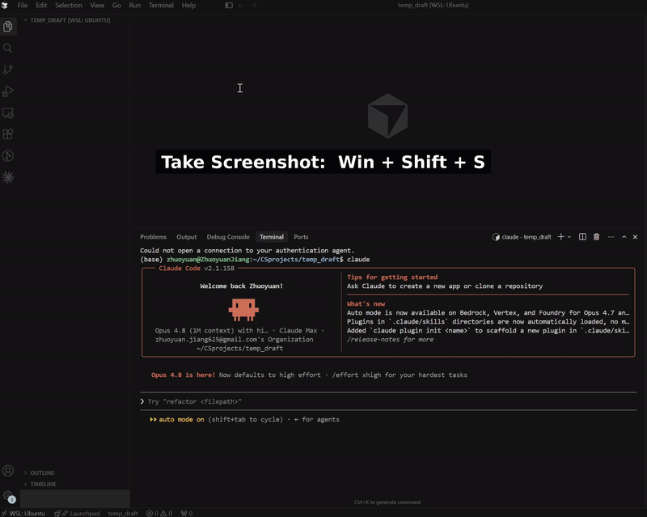

# wsl-paste-image-in-claudecode-terminal

**Take a screenshot with `Win+Shift+S`, press `Alt+V`, and it pastes straight into Claude Code — on WSL, with no Windows `.exe` needed.**



---

## The problem

You run Claude Code inside WSL. You take a screenshot with `Win+Shift+S` and press `Alt+V` (or `Ctrl+V`) to paste it — but Claude Code just says:

> `No image found in clipboard`

…even though that exact screenshot pastes fine into ChatGPT, Word, or Paint on Windows.

**Why:** WSL's clipboard bridge (WSLg) hands the screenshot to Linux as an old 32-bit BMP format (`BI_BITFIELDS`) that Claude Code's image reader can't decode. So it gives up and says "No image found."

This tool fixes that — entirely on the Linux side, so it works **even if your WSL→Windows interop is broken/disabled** (which is what trips up most other fixes).

---

## Setup (one time, ~1 minute)

**1. Install the two dependencies:**

```bash
sudo apt install wl-clipboard python3-pil
```

> If you use Anaconda/Miniconda, you already have Pillow — `python3-pil` is just the non-conda way to get it.

**2. Clone this repo and run the installer:**

```bash
git clone https://github.com/ZhuoyuanJiang/wsl-paste-image-in-claudecode-terminal.git
cd wsl-paste-image-in-claudecode-terminal
./install.sh --autostart
```

That's it. `--autostart` makes it start automatically every time you open a WSL terminal (it backs up your `~/.bashrc` first). Open a new terminal, or just start it now:

```bash
nohup claude-clip-bridge >/dev/null 2>&1 & disown
```

---

## How to use

1. Screenshot with **`Win+Shift+S`**
2. Press **`Alt+V`** in Claude Code

The image pastes in. Done. (Use `Alt+V`, not `Ctrl+V` — Claude Code on Windows/WSL binds image paste to `Alt+V`.)

It works across **all** your Claude Code windows at once — it's a single background helper watching the shared clipboard, not something per-window.

---

## Troubleshooting

**Still says "No image found"?**

```bash
claude-clip-bridge --status      # should print: running
```

- If it says `stopped`, start it: `nohup claude-clip-bridge >/dev/null 2>&1 & disown`
- Then take a **fresh** screenshot and press `Alt+V` again.
- Check `echo $WAYLAND_DISPLAY` prints something (e.g. `wayland-0`). If it's empty, your WSL doesn't have WSLg — update WSL from Windows with `wsl --update`.

**Commands:**

```bash
claude-clip-bridge --status   # is it running?
claude-clip-bridge --stop     # stop it
claude-clip-bridge --once     # convert the current clipboard image once (handy for testing)
claude-clip-bridge --help
```

---

## Stopping it

```bash
claude-clip-bridge --stop      # stop the background helper for now
# or, equivalently:
pkill -f claude-clip-bridge
```

These stop it immediately, but if you installed with `--autostart` it comes back when you open a **new** terminal (usually what you want). To keep it off across new terminals without uninstalling:

```bash
claude-clip-bridge --disable   # stop + remove autostart   (run --enable to undo)
```

To remove it completely, see Uninstall below.

---

## Uninstall

```bash
./uninstall.sh
```

Stops the helper, removes it, and strips the autostart line from `~/.bashrc` (a backup is kept).

---

## How it works (optional reading)

```
Win+Shift+S                 Windows clipboard holds the screenshot as a BMP
   │
   ▼  WSLg syncs it to the Linux/Wayland clipboard as image/bmp (BI_BITFIELDS)
   │     └─ Claude Code can't decode this → "No image found"
   ▼
claude-clip-bridge  notices an image that isn't PNG, decodes the BMP with
   │                Python/Pillow, and re-publishes it as image/png (wl-copy)
   ▼
Wayland clipboard now offers image/png  →  Alt+V in Claude Code works ✅
```

A tiny background daemon polls the Wayland clipboard. Whenever there's an image that isn't already `image/png`, it converts it and re-asserts the PNG a few times (WSLg sometimes overwrites it back to BMP). It only ever touches **images** — text on the clipboard is never modified. No Windows process is ever launched; nothing is installed or changed on the Windows side.

**Requirements:** WSL2 + WSLg, `wl-clipboard`, Python 3 with Pillow. Tested on Ubuntu 24.04 (WSL2), `wl-clipboard` 2.2.x, Pillow 11.x.

**Security note:** the daemon pipes image bytes into Pillow to decode them. Like any image library, Pillow occasionally has parsing CVEs — keeping it reasonably up to date is good hygiene. The input is your own clipboard, never remote data.

---

## License

MIT — see [LICENSE](LICENSE). Contributions and issues welcome.

## Acknowledgements

The `BI_BITFIELDS` BMP root cause is discussed in the WSL/Claude Code community, e.g. [anthropics/claude-code#50552](https://github.com/anthropics/claude-code/issues/50552) and [rajveerb/wsl-clip-bridge](https://github.com/rajveerb/wsl-clip-bridge). This project's angle is a **pure-Linux** fix that needs no Windows interop.

---

<h3 align="center">⭐ If this saved you some time, a star or a link back is appreciated!</h3>
